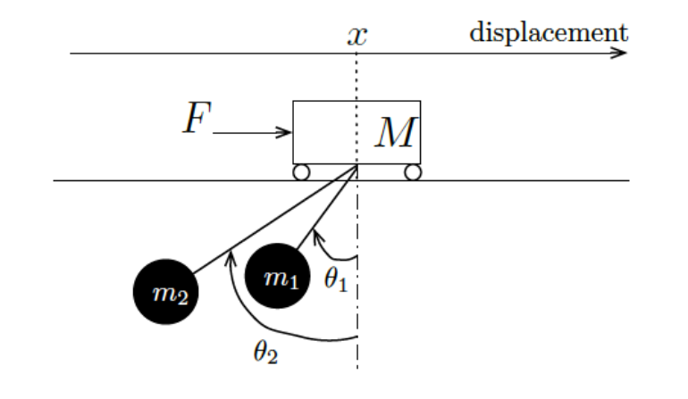

# LQR and LQG Controller For a Moving Crane
Control System Course (ENPM667) Final Project

## Overview
We have been given a crane moving along a one-dimensional track. It behaves as a
friction-less cart with mass M actuated by an external force F that constitutes the system’s input. There are two loads suspended from cables attached to the crane. The loads have mass m1 and m2, and the lengths of the cables are l1 and l2, respectively.
The following figure depicts the crane and associated variables used throughout this project.


---
## Implementation
### LQR Controller
Use `LQR_Controller.ipynb` for Simulating LQR Controller on the model, and getting output response.
## Obervability:
Use `Observability_sim.ipynb` for Simulating
* Luenberger Observer
* LQG Controller

And getting there non linear system, unit step, and initial condition response.

---
## Dependecies
* python3
* Jupyter Notebook
* Listed in requirements.txt
* Command to Install
```
pip3 install requirements.txt
```
